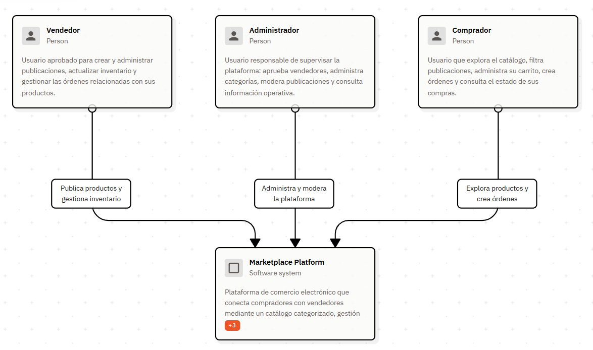
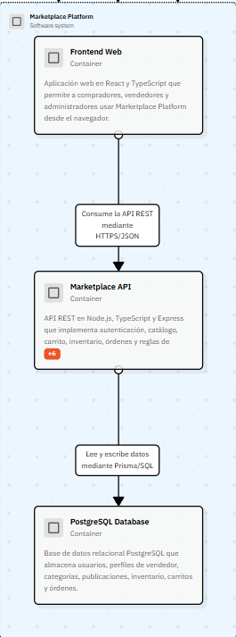
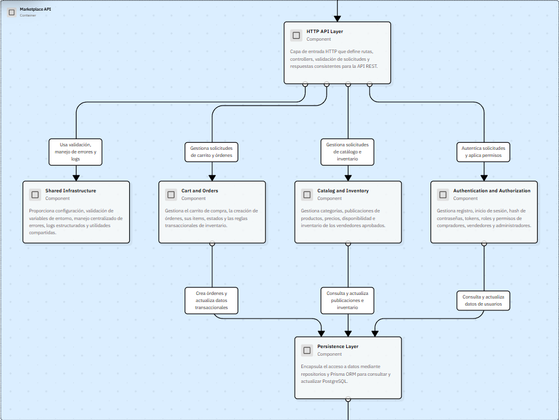
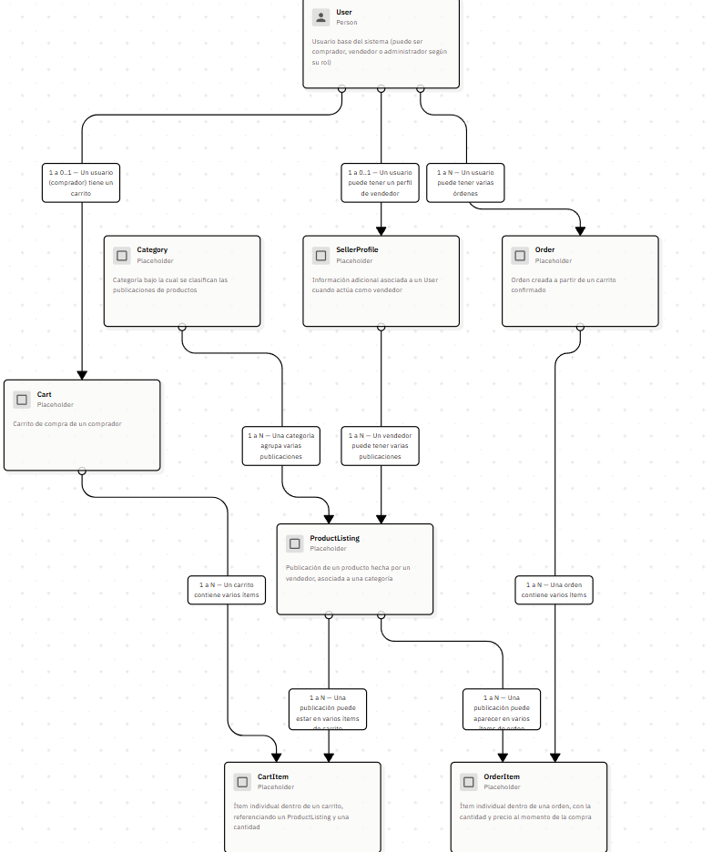

# Arquitectura del sistema — Marketplace E-commerce

Este documento reúne la documentación arquitectónica del proyecto, modelada con el enfoque C4 (Contexto, Contenedores, Componentes) más vistas complementarias de infraestructura, casos de uso, flujo transaccional y modelo de datos.

La documentación fue diseñada en [Isoflow](https://isoflow.io) y se mantiene en fase de diseño: las decisiones aún no definidas se marcan explícitamente como **"Decisión propuesta"** o **"Pendiente"**, en lugar de asumirse como ya implementadas.

## Índice de vistas

| Vista | Pregunta que responde |
|---|---|
| [01 — Contexto del sistema (C1)](#01--contexto-del-sistema-c1) | ¿Quién usa el sistema y para qué? |
| [02 — Contenedores (C2)](#02--contenedores-de-marketplace-platform-c2) | ¿Qué aplicaciones y bases de datos forman el sistema? |
| [03 — Componentes de Marketplace API (C3)](#03--componentes-de-marketplace-api-c3) | ¿Cómo está organizada internamente la API? |
| [04 — Infraestructura y despliegue](#04--infraestructura-y-despliegue) | ¿Cómo se ejecuta, prueba y despliega el proyecto? |
| [05 — Casos de uso](#05--casos-de-uso) | ¿Qué funcionalidades ofrece el sistema? |
| [06 — Flujo de compra y creación de orden](#06--flujo-de-compra-y-creación-de-orden) | ¿Cómo protegemos el inventario y creamos una orden válida? |
| [07 — Modelo de datos / ERD](#07--modelo-de-datos--erd) | ¿Cómo se estructura y relaciona la información? |

---

## Objetivo del proyecto

Marketplace de comercio electrónico que conecta compradores con vendedores mediante un catálogo de productos categorizado, gestión de inventario, carrito de compra y creación de órdenes, con roles de comprador, vendedor y administrador.

Proyecto de portafolio construido con Node.js, TypeScript, React, PostgreSQL, Prisma ORM, Docker y GitHub Actions. La arquitectura se mantiene deliberadamente simple: sin microservicios, sin colas de mensajes ni infraestructura adicional, salvo que exista una razón explícita para introducirla.

---

## 01 — Contexto del sistema (C1)

**Pregunta:** ¿Quién usa el sistema y para qué?

**Elementos:** Comprador, Vendedor, Administrador, Marketplace Platform.

---

## 02 — Contenedores de Marketplace Platform (C2)

**Pregunta:** ¿Qué aplicaciones y bases de datos forman el sistema?

**Elementos:** Frontend Web (React + TypeScript), Marketplace API (Node.js + TypeScript + Express), PostgreSQL Database.

---

## 03 — Componentes de Marketplace API (C3)

**Pregunta:** ¿Cómo está organizada internamente la API?

**Elementos:** HTTP API Layer, Authentication and Authorization, Catalog and Inventory, Cart and Orders, Persistence Layer, Shared Infrastructure.

---

## 04 — Infraestructura y despliegue

**Pregunta:** ¿Cómo se ejecuta, prueba y despliega el proyecto?

**Zonas:**

- **Desarrollo local** — Entorno de ejecución local orquestado con Docker Compose, usado por la desarrolladora para levantar y probar el sistema completo (frontend, API y base de datos) antes de subir cambios al repositorio.  
- **CI/CD** — Pipeline de integración y despliegue continuo ejecutado en GitHub Actions. Se dispara al recibir cambios en el repositorio, valida el código mediante lint y pruebas automatizadas, construye la imagen Docker y publica el artefacto listo para desplegar. 
- **Producción** — Entorno donde se ejecuta la versión desplegada del sistema, accesible para los usuarios finales. Expone la API mediante un contenedor productivo con endpoints de salud (health check) y logs estructurados, respaldado por una base de datos PostgreSQL administrada. 

**Pendiente:**
- ¿El despliegue a producción es manual o automático?
- ¿PostgreSQL administrado corre como servicio gestionado (RDS/Supabase/Railway) o como contenedor propio?

---

## 05 — Casos de uso

**Pregunta:** ¿Qué funcionalidades ofrece el sistema?

**Comprador:** explorar productos, filtrar productos, administrar carrito, crear órdenes, consultar estado de compras. 

**Vendedor:** publicar productos, administrar publicaciones, gestionar inventario, gestionar órdenes relacionadas con sus productos. 

**Administrador:** aprobar vendedores, administrar categorías, moderar publicaciones, consultar información operativa. 

**Pendiente:** ¿Se debe incluir un caso de uso explícito de "Registro/Login", o se mantiene implícito como precondición (ya cubierto por Authentication and Authorization en la vista 03)?

---

## 06 — Flujo de compra y creación de orden

**Pregunta:** ¿Cómo protegemos el inventario y creamos una orden válida?

[Parte 1](./diagrams/06-flujo-compra-p1.png)
[Parte 2](./diagrams/06-flujo-compra-p2.png)

**Flujo:** Producto → Carrito → Validación → Transacción → (Orden + Actualización de inventario, en paralelo) → Confirmación.

La creación de la orden y la actualización del inventario ocurren dentro de la misma transacción, garantizando consistencia. Los detalles de implementación (locking, isolation level, etc.) se definirán cuando exista código real que los justifique.

---

## 07 — Modelo de datos / ERD

**Pregunta:** ¿Cómo se estructura y relaciona la información?

 

**Entidades:** User, SellerProfile, Category, ProductListing, Cart, CartItem, Order, OrderItem.

**Decisiones propuestas (pendientes de confirmar):**
- `User`–`Cart`: cardinalidad 1 a 0..1 (un comprador tiene a lo sumo un carrito activo).
- `OrderItem` guarda un snapshot del precio al momento de la compra, para que cambios futuros de precio no alteren órdenes ya creadas.

**Pendiente:**
- ¿`SellerProfile` requiere un campo de estado (pendiente/aprobado/rechazado) para reflejar la aprobación del administrador?
- Posible vista futura (08) para el ciclo de vida / estados de una orden.

---

## Reglas de diseño

- No se introducen microservicios, colas de mensajes ni infraestructura adicional sin una razón explícita.
- Las decisiones no definidas se marcan como "Decisión propuesta" o "Pendiente", nunca se asumen silenciosamente.
- No se documenta a nivel de clases, métodos o queries concretas mientras el proyecto esté en fase de diseño (sin C4: Code todavía).
